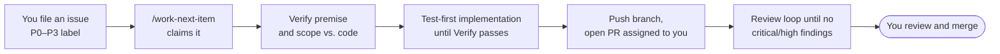

# claude-code-repo-template

**A GitHub template for repositories where [Claude Code](https://code.claude.com/docs/en/overview) does the work and a human merges.**

It gives an AI coding agent a structured backlog to work from, a definition of
"done" to meet, a review loop to pass, and guardrails that keep it from merging or
pushing to `main`. You file issues; the agent turns them into reviewed pull
requests; you decide what ships.

Everything here is plain files — Claude Code settings, shell scripts, GitHub issue
templates, and a workflow — so there is no service to run and nothing to install
beyond the tools you already use.

## Who it is for

- Solo developers and small teams who want to hand a backlog to Claude Code and
  review PRs rather than write every change by hand.
- Anyone running Claude Code **unattended** (headless `claude -p`, `/loop`, or a
  scheduled cloud routine) who needs the safety rules to live in the repository,
  where every session can see them, rather than in one person's local config.

## What it does

| Capability | What you get |
|---|---|
| **Merge and push guardrails** | A committed `.claude/settings.json` that denies merging PRs (CLI, REST API, and GitHub MCP tools), pushing to `main`, force pushes, tag pushes, and the GitHub MCP file-write tools. Because it is committed, it applies to cloud and headless sessions too. |
| **Autonomous backlog loop** | `/work-next-item` takes the highest-priority open issue, checks that the issue's diagnosis matches the code, derives the full scope from the code rather than the issue text, implements it test-first, runs your verify commands, and opens a PR assigned to you. One issue, one branch, one PR — never merged. |
| **Cold-context driver** | `scripts/backlog-loop.sh` runs one issue per fresh `claude -p` session, so a long backlog never exhausts a context window. All state lives in git and issue labels, so it is safe to stop and resume at any time. |
| **Specialist reviewers** | Two reviewer agents, `pr-test-analyzer` and `silent-failure-hunter`, that the loop runs before opening each PR in any repo whose `CLAUDE.md` lists them under `## Specialist reviewers`. The skeleton `CLAUDE.md` does; a repo synced with an existing `CLAUDE.md` must add that table (copy it from the template). They are vendored from [ECC](https://github.com/affaan-m/ECC) (MIT) by `scripts/vendor-agents.sh`, which adds your repo's context, so they work in cloud sessions that load no plugins. |
| **PR review loop** | Hooks that start a `/code-review` when a PR is opened and keep the session from ending until the review's critical and high findings are resolved — with a round cap and timeouts so it cannot run forever. |
| **Issue conventions** | Feature and bug issue forms (the key sections are required fields) and a guide (`docs/ISSUE_GUIDE.md`) that make each issue a self-contained work item an agent can pick up cold, plus a script that creates the priority and status labels the loop uses. |
| **CI skeleton** | A workflow that runs on branches and PRs with read-only permissions, and fails until you configure it — so a new repo never shows a green check that tests nothing. Actions are pinned to commit SHAs, and Dependabot keeps the pins current. |
| **Repo defaults** | A PR template for PRs opened by hand, and an `.editorconfig` with LF endings, final newlines, and tabs where a format requires them. |
| **Sync for existing repos** | `scripts/sync-guardrails.sh` brings any existing repository up to date with this template without overwriting the parts you have customised. |

## How it works



The loop is generic. Everything specific to your project comes from sections of
your repo's `CLAUDE.md`:

| Section | Required | What it tells the loop |
|---|---|---|
| `## Verify` | **Yes** | The build, lint, and test commands that define "green". The loop refuses to start without real commands here. |
| `## Definition of done` | No | Checks a green build cannot prove — deploy wiring, infrastructure, docs. |
| `## Scope map` | No | Where to enumerate what an issue could touch — route tables, handler directories, page registries. |
| `## Specialist reviewers` | No | Which reviewer agents in `.claude/agents/` cover which paths. The skeleton enables the two that ship with the template. |

## Requirements

- [Claude Code](https://code.claude.com/docs/en/overview), with its `/code-review` command available
- [GitHub CLI](https://cli.github.com/) (`gh`), authenticated
- `git`, `bash`, and [`jq`](https://jqlang.org/)

## Getting started

### A new repository

Click **Use this template** on GitHub, or:

```sh
gh repo create my-app --private --template highhair20/claude-code-repo-template --clone
cd my-app
```

Then run the setup check. It is read-only, lists what is left to do, and gives the
command that fixes each item:

```sh
scripts/setup.sh          # check only
scripts/setup.sh --fix    # also swap in the CLAUDE.md skeleton, create the labels and the local allowlist
```

It exits 0 once nothing is failing, so re-run it until it does. The steps it checks:

1. **Fill in `CLAUDE.md`**, above all the `## Verify` section. A new repo starts
   with this template's own `CLAUDE.md`; `setup.sh --fix` replaces it with the
   project skeleton from `templates/CLAUDE.md`, and the loop refuses to run until it
   is replaced. Write every command to run from the repo root and never `cd`,
   because the loop may run several in one shell.
2. **Configure CI.** Replace the failing placeholder step in
   `.github/workflows/ci.yml` with the same Verify commands, so CI and the loop
   agree on what "green" means. Then see
   [`docs/CI_HARDENING.md`](docs/CI_HARDENING.md) for steps that stop a green
   check from hiding skipped tests, fetched tools, or flaky coverage.
3. **Create the labels:** `scripts/seed-labels.sh` (or `setup.sh --fix`). It is
   safe to re-run.
4. **Protect `main`:** `scripts/protect-main.sh <owner>/<repo> <ci-job-name>…`.
   It creates a branch ruleset that requires a pull request and the named CI
   checks, and lets admins bypass only by merging a PR. This is the only guardrail
   that holds no matter how a command is phrased (see [Limits](#limits)). It is
   safe to re-run. Rulesets are free on public repositories; private repositories
   need a paid GitHub plan.
5. **Allow the loop's commands** if you will run it unattended — see
   [Running the backlog loop](#running-the-backlog-loop).

### An existing repository

Clone this template next to your repo and sync it in:

```sh
git clone https://github.com/highhair20/claude-code-repo-template.git
claude-code-repo-template/scripts/sync-guardrails.sh ./my-app     # my-app must have a clean working tree
cd my-app && scripts/setup.sh --fix
```

`setup.sh` then lists anything still missing, such as the branch ruleset.

The sync never commits. Review `git diff` in your repo, then commit it on a branch.
It treats files three ways, so re-running it later is safe:

| Kind | Files | On every sync |
|---|---|---|
| **Managed** | review hooks, `work-next-item.md`, `backlog-loop.sh`, `check-verify-section.sh`, `loop-lock.sh`, `protect-main.sh`, `seed-labels.sh`, `setup.sh`, `vendor-agents.sh`, `settings.local.json.example` | Overwritten. These hold no project-specific content; put customisation in `CLAUDE.md`. |
| **Seeded** | `CLAUDE.md` (the skeleton in `templates/`), CI workflow, issue forms, PR template, `dependabot.yml`, `docs/ISSUE_GUIDE.md`, `docs/BACKLOG.md`, `docs/CI_HARDENING.md`, the reviewer agents and their `.claude/agent-context/` | Copied only if missing. Yours to edit. Nothing is added beside an equivalent you already have: the placeholder CI only goes into a repo with no workflows, the issue forms only into one with no issue templates of its own, the PR template only if GitHub finds none anywhere, and `dependabot.yml` not beside a `dependabot.yaml`. `.editorconfig` is never synced; its indent defaults could change how editors treat existing code. |
| **Merged** | `.claude/settings.json`, `.gitignore` | The template's deny rules, hooks, and ignore lines are added; yours are kept. |

Each sync also writes `.claude/template-version`: the template commit your repo now
matches (suffixed `-dirty` if the template clone had uncommitted changes). Commit
it with the rest, so you can tell later how far behind the template a repo is.

## Running the backlog loop

Write issues with the templates, give each exactly one priority label (`P0`–`P3`;
`P3` is never picked automatically), then choose how to run it:

| How | When |
|---|---|
| `/work-next-item` in a Claude Code session | Work one issue while you watch. |
| `/loop /work-next-item` | Keep working issues in one session. |
| `scripts/backlog-loop.sh` | Unattended. Each issue gets a fresh `claude -p` session; stops when the backlog is empty, when an item makes no progress, or after `MAX_ITEMS` (default 25). |

**Unattended runs need permissions.** A headless session cannot ask you to approve
a command, so allow everything the loop runs in `.claude/settings.local.json`.
Start from the example, then add your Verify commands to its `allow` list:

```sh
cp .claude/settings.local.json.example .claude/settings.local.json
```

The example covers every `gh` and `git` command `/work-next-item` runs; a test
keeps the two in step. The committed deny rules still win over any allow rule, so
merges and pushes to `main` stay blocked. If a command is missing, the first item
stops early and the driver reports "no progress"; that item's log in `.loop-logs/`
names the refused command.

**One driver at a time.** `backlog-loop.sh` holds a lock in the git directory
(`.git/backlog-loop.lock`) while it runs, so a second driver in the same clone
refuses to start, whatever its `LOG_DIR`. A lock left by a crashed or killed run is
reclaimed automatically, because it records its owner's PID. If a run is refused and
you know no loop is running, the message gives the `rm -rf` that clears the lock.

The loop manages these status labels: `in-progress`, `in-review`, `blocked`,
`needs-infra`, and `needs-attention` (it gave up and a human should look). See
[`docs/ISSUE_GUIDE.md`](docs/ISSUE_GUIDE.md) for the full set.

## Safety model

The guardrails are layered, from softest to hardest:

1. **Instructions** — `CLAUDE.md` and the loop command say never to merge or push
   to `main`.
2. **Permission rules** — `.claude/settings.json` denies those commands and tools
   outright, in every local, headless, and cloud session.
3. **CI** — required checks run on every PR.
4. **Branch ruleset** — GitHub itself refuses a direct push or unreviewed merge to
   `main`. You set this up once per repo.
5. **You** — every change reaches `main` only through a merge you make.

## Limits

- **Permission rules match command text; they are a filter, not a wall.** A
  sufficiently unusual spelling of a push to `main` can get past them. The branch
  ruleset in step 4 is the hard block.
- The deny rules block merging through `gh api`, but not other raw API writes: a
  `gh api -X PUT repos/<owner>/<repo>/contents/<path>` can still write to `main`.
  The branch ruleset blocks that too.
- The push rule for git global options (`git -C <dir> push …`) also denies a few
  non-push commands, such as `git -C . commit -m "fix push flow"`. Commit without
  `-C`.
- The rule that blocks pushing a release tag (`git push origin v1.2.3`, because tags
  often trigger deploys) also blocks pushing any branch whose name starts with `v`.
  The loop's `<type>/<issue>-<slug>` branch names never do.
- The review hook finds the new PR's URL in `gh pr create`'s output. If you capture
  that output (`URL=$(gh pr create …)`), no review loop opens; start one by hand
  with `.claude/hooks/pr-review-state.sh seed <pr> <url>`.
- The sync only ever adds deny rules. A rule later removed from the template stays
  in repos that already have it; delete it by hand.
- Known issues and planned improvements are tracked in
  [Issues](https://github.com/highhair20/claude-code-repo-template/issues).

## What's in the repo

```text
.claude/
  settings.json              deny rules + hook registration (committed on purpose)
  settings.local.json.example  allowlist for unattended runs (copy, then add Verify)
  commands/work-next-item.md the backlog loop command
  hooks/pr-*.sh              PR review loop
.github/
  ISSUE_TEMPLATE/            feature and bug issue forms
  pull_request_template.md   PR body for PRs opened by hand
  dependabot.yml             weekly updates for the pinned actions
  workflows/ci.yml           CI skeleton (fails until configured)
  workflows/template-self-test.yml   tests this template's scripts; inert in your repo
docs/ISSUE_GUIDE.md          how to write issues the loop can work
docs/BACKLOG.md              operating the loop: drivers, one iteration, definition of done, why each guardrail
docs/CI_HARDENING.md         CI patterns that keep a green check honest, with snippets
scripts/
  backlog-loop.sh            unattended driver
  check-verify-section.sh    refuses to run without Verify commands
  loop-lock.sh               one loop run per clone; reclaims a crashed run's lock
  sync-guardrails.sh         update an existing repo from this template
  setup.sh                   check the repo is ready for the loop; --fix the safe parts
  vendor-agents.sh           rebuild .claude/agents/ from ECC plus .claude/agent-context/
  seed-labels.sh             create the standard labels
  protect-main.sh            create the branch ruleset on main
  test-*.sh                  tests for the scripts above
  run-tests.sh               run every test-*.sh (this repo's Verify; not synced)
templates/CLAUDE.md          skeleton for your project's instructions
CLAUDE.md                    this template repo's own instructions (replaced in new repos)
.editorconfig                editor defaults
```

## Contributing

Issues and pull requests are welcome. Run the tests before opening a PR:

```sh
scripts/run-tests.sh
shellcheck --severity=warning scripts/*.sh .claude/hooks/*.sh
```

These are the Verify commands in this repo's `CLAUDE.md`, and CI runs the same two,
so the backlog loop can work this repo's own issues. The tests are plain bash and
need only `git`, `jq`, and `ruby` (for YAML); a new `scripts/test-*.sh` is picked up
automatically.

## License

[MIT](LICENSE)
